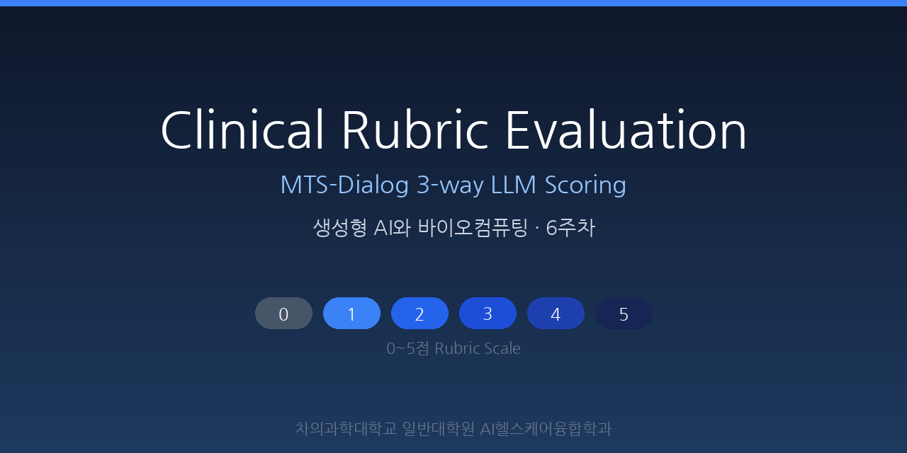

# Clinical Rubric Evaluation

MTS-Dialog 3-way LLM Scoring tool for 생성형 AI와 바이오컴퓨팅 (A004174) Week 6.

## Status

- [x] Step 1: 데이터 풀 + 썸네일 배포 (현재 커밋)
- [ ] Step 2: 학생 웹 채점 UI (체크박스 10개 선택 + 0~5점 루브릭)
- [ ] Step 3: Google Apps Script Sheets 엔드포인트 (POST/GET)
- [ ] Step 4: Colab에서 세션 조회 및 LLM 3-way 비교
- [ ] Step 5: 관리자 도구 (IAA 계산, 전체 세션 조회)

## Live

https://sdkparkforbi.github.io/clinical-rubric-eval/

## 구성 파일

| 파일 | 역할 |
|---|---|
| `mts_pool.json` | MTS-Dialog 풀 30개 (seed=42, 길이 500~3000자) |
| `thumb.png` | 소셜 프리뷰 썸네일 (1280×640) |
| `index.html` | Step 2 채점 UI가 들어갈 자리 (현재는 placeholder) |
| `README.md` | 이 문서 |

## 차의과학대학교 일반대학원 AI헬스케어융합학과

박대근 교수 · 생성형 AI와 바이오컴퓨팅 (A004174)
